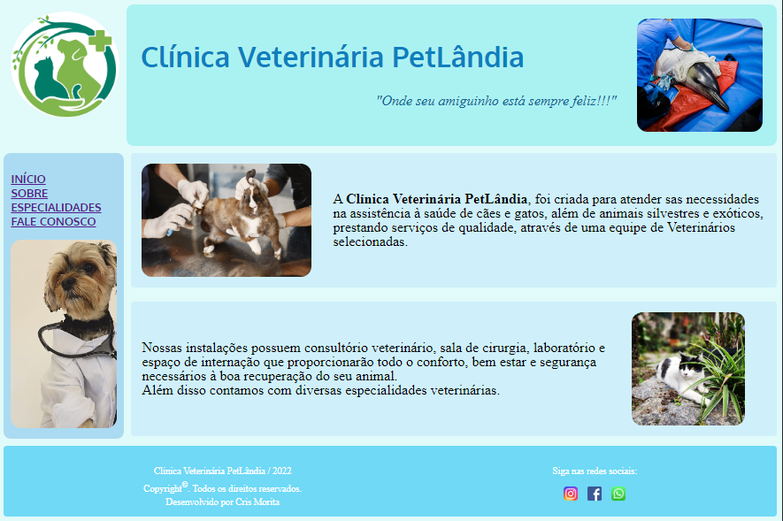

# Desafio HTML - Clínica PetLândia 🐶🐱🐹🐰                     

> NTT Data Diversidade em Tech - DIO.me 🧐

Desafio proposto é desenvolver um site de uma clínica médica. 
Utilizar todo conteúdo abordado no módulo para a implementação de elementos fundamentais de uma página:

- Estrutura básica HTML
- Tags
- Tabelas
- Formularios
- Mídias
- Links
    

[Clique aqui para acessar!!👈](https://tiemi9.github.io/Clinica-Desfio.NTTData)

## 📡 Tecnologias

- HTML,
- CSS,
-  Git e GitHub 

##  💻 Contato

https://www.linkedin.com/in/cristiemim9

 ### 🎉 Agradecimentos 
##### À toda equipe da DIO.me, e principalmete à Diogo Mainardes, que ministrou as aulas de HTML, na plataforma da DIO. Bora decolar!!! 🚀